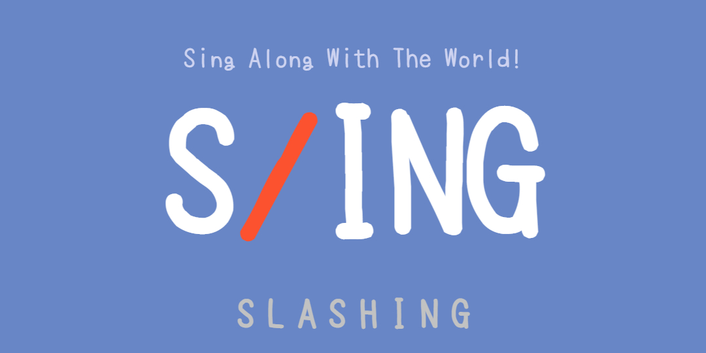

# 🌳 NamuIsTree 🌳

<h3 align="center" style="border-bottom: none;"> 😊 Projects 😊 </h2>

  - **MoonTomi Project ( 2020.12.24 ~ 서비스 중)**
    * 개인 음악 평론회를 지원하는 서비스들을 제공합니다.
  
    

          
      </a> &nbsp
      </a> &nbsp
      </a> &nbsp
      </a> &nbsp
      </a> &nbsp
      </a> &nbsp 
      </a> &nbsp
    

    + [Demo Project](http://moontomi.duckdns.org) (Closed)
      + Web : https://github.com/NamuIsTree/MoonTomi
      + API : https://github.com/NamuIsTree/Musicweb_upload
    + [Main Project](http://moontomi.ga)
      + Web : https://github.com/NamuIsTree/Moontomi_v2.0
      + API : https://github.com/NamuIsTree/MoonTomi_API

  - **S/ing Project ( 2021.03.26 ~ 2021.06.11 )**
    * 유투브 동영상에 대한 다구간 반복 기능을 제공하여, 노래를 따라 부르기 위해 연습할 수 있는 서비스를 만듭니다.
    
    

          
      </a> &nbsp
      </a> &nbsp
      </a> &nbsp
      </a> &nbsp
      </a> &nbsp
    

    + [Demo Project](http://slashing.duckdns.org)
      + Web : https://github.com/NamuIsTree/Slashing_web
      + API (for spleeter ... server shutdowned) : https://github.com/NamuIsTree/Slashing_api
      + API (for mongoDB)  : https://github.com/NamuIsTree/Slashing_db_api
---

<h3 align="center"> 💻 Competitive Programming 💻 </h2>
  
  

    </a> &nbsp
    </a> &nbsp
  

  - 2020 Summer SUAPC Div.1 2위 (talsogang)
    + [Standings](https://icpc-sinchon.github.io/suapc)
  - 2020 ICPC Asia Seoul Regional Contest 본선 16위 (GrayWater)
    + [Standings](https://icpc.global/regionals/finder/Seoul-2020/standings)
  - 2020 Sogang Programming Contest 출제
    + [Champion B](https://www.acmicpc.net/problem/20292)
    + [Champion D](https://www.acmicpc.net/problem/20294)
  - 2021 ICPC Sinchon Winter Algorithm Camp Contest 출제 
    + [Intermediate B](https://www.acmicpc.net/problem/20928)
    + [Intermediate G](https://www.acmicpc.net/problem/20933)
    + [Intermediate H](https://www.acmicpc.net/problem/20934)
  - Codeforces Expert (1711 Rated)
    + [Codeforces Profile](https://codeforces.com/profile/NamuTree)
  - Baekjoon Online Judge (solved.ac)
    + [BOJ Profile](https://www.acmicpc.net/user/woonikim)

   

---
